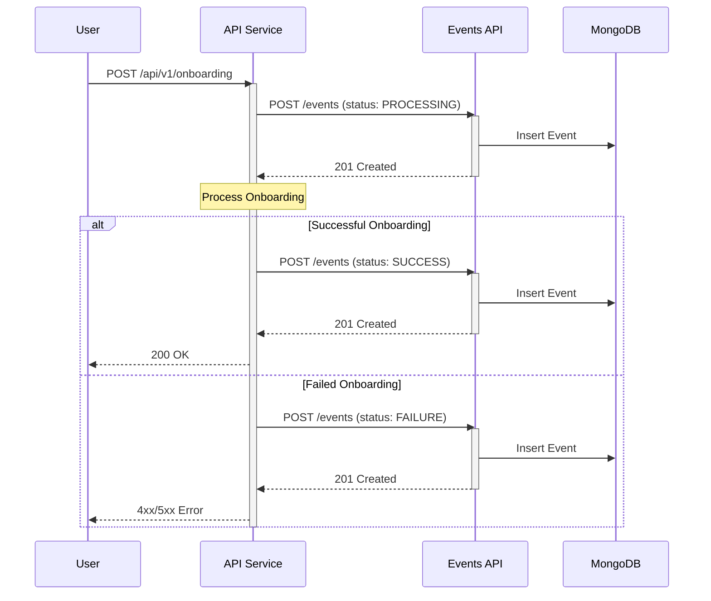

# Events API Documentation

## 1. Service Overview

### 1.1 Purpose
The Events API is a centralized service for collecting and retrieving API events across the system. It provides a standardized way to track, store, and query API interactions, enabling comprehensive monitoring, debugging, and audit capabilities.

### 1.2 Scope
#### In Scope
- Collecting API event data (requests, responses, errors)
- Storing event data with correlation tracking
- Retrieving event data by ID and timestamps
- Supporting system-wide event tracking and monitoring

#### Out of Scope
- Real-time event streaming
- Event processing or analytics
- Alert generation
- Event aggregation or reporting

### 1.3 Sequence Diagram


### 1.4 Service Dependencies
- **Upstream Services:**
  - Any service that needs to log API events
- **Downstream Dependencies:**
  - MongoDB database for event storage

## 2. Data Model

### 2.1 Core Entities
#### ApiEvent
```json
{
    "id": "uuid",
    "eventType": "string",
    "sourceSystem": "string",
    "eventTime": "datetime",
    "eventData": {
        "endpoint": "string",
        "method": "string",
        "requestBody": "object",
        "responseBody": "object",
        "statusCode": "integer"
    },
    "correlationId": "string",
    "userContext": {
        "userId": "string",
        "clientId": "string",
        "ipAddress": "string"
    },
    "status": "string",
    "created_at": "datetime",
    "updated_at": "datetime"
}
```

### 2.2 Field Level Mapping
| Field Name | Data Type | Required | Description | Validation Rules | Default Value |
|------------|-----------|----------|-------------|------------------|---------------|
| id | UUID | Yes | Unique identifier for the event | Auto-generated | None |
| eventType | String | Yes | Type of API event (e.g., REQUEST, RESPONSE, ERROR) | max_length=50, enum values | None |
| sourceSystem | String | Yes | System/service that generated the event | max_length=100 | None |
| eventTime | DateTime | Yes | Time when the event occurred | ISO 8601 format | None |
| eventData.endpoint | String | Yes | API endpoint path | max_length=500 | None |
| eventData.method | String | Yes | HTTP method | enum: GET, POST, PUT, DELETE, etc. | None |
| eventData.requestBody | Object | No | Request payload | max_size=1MB | null |
| eventData.responseBody | Object | No | Response payload | max_size=1MB | null |
| eventData.statusCode | Integer | Yes | HTTP status code | range: 100-599 | None |
| correlationId | String | Yes | ID to correlate related events | UUID format | None |
| userContext.userId | String | No | ID of the user making the request | max_length=100 | null |
| userContext.clientId | String | No | ID of the client application | max_length=100 | null |
| userContext.ipAddress | String | No | IP address of the client | valid IP format | null |
| status | String | Yes | Overall event status | enum: PROCESSING, SUCCESS, FAILURE | None |
| created_at | DateTime | Yes | Record creation timestamp | Auto-generated | Current timestamp |
| updated_at | DateTime | Yes | Record last update timestamp | Auto-generated | Current timestamp |

### 2.3 Database Schema
```javascript
// MongoDB Collection: core_api_events
{
  // Schema Definition
  validator: {
    $jsonSchema: {
      bsonType: "object",
      required: ["eventType", "sourceSystem", "eventTime", "eventData", "correlationId", "status", "created_at", "updated_at"],
      properties: {
        _id: { bsonType: "binData" },  // UUID stored as Binary
        eventType: {
          bsonType: "string",
          enum: ["REQUEST", "RESPONSE", "ERROR"]
        },
        sourceSystem: {
          bsonType: "string",
          maxLength: 100
        },
        eventTime: { bsonType: "date" },
        eventData: {
          bsonType: "object",
          required: ["endpoint", "method", "statusCode"],
          properties: {
            endpoint: {
              bsonType: "string",
              maxLength: 500
            },
            method: {
              bsonType: "string",
              enum: ["GET", "POST", "PUT", "DELETE", "PATCH", "HEAD", "OPTIONS"]
            },
            requestBody: { bsonType: "object" },
            responseBody: { bsonType: "object" },
            statusCode: {
              bsonType: "int",
              minimum: 100,
              maximum: 599
            }
          }
        },
        correlationId: { bsonType: "binData" },  // UUID stored as Binary
        userContext: {
          bsonType: "object",
          properties: {
            userId: {
              bsonType: "string",
              maxLength: 100
            },
            clientId: {
              bsonType: "string",
              maxLength: 100
            },
            ipAddress: { bsonType: "string" }
          }
        },
        status: {
          bsonType: "string",
          enum: ["PROCESSING", "SUCCESS", "FAILURE"]
        },
        created_at: { bsonType: "date" },
        updated_at: { bsonType: "date" }
      }
    }
  }
}

// Indexes
db.core_api_events.createIndex({ "correlationId": 1 });
db.core_api_events.createIndex({ "eventTime": 1 });
db.core_api_events.createIndex({ "sourceSystem": 1 });
db.core_api_events.createIndex({ "created_at": 1 });
```

## 3. API Endpoints

### 3.1 Base URL
```
https://api.example.com/v1/events
```

### 3.2 Endpoint Definitions

#### Create Event
- **Method:** POST
- **Path:** `/events`
- **Required Scope:** `events.write`

##### Request Body Example (Initial Processing Event)
```json
{
    "eventType": "REQUEST",
    "sourceSystem": "user-service",
    "eventTime": "2024-01-20T10:30:00Z",
    "eventData": {
        "endpoint": "/api/v1/users",
        "method": "POST",
        "requestBody": {
            "username": "john.doe"
        },
        "statusCode": 202
    },
    "correlationId": "123e4567-e89b-12d3-a456-426614174000",
    "userContext": {
        "userId": "user123",
        "clientId": "web-app",
        "ipAddress": "192.168.1.1"
    },
    "status": "PROCESSING"
}
```

##### Request Body Example (Final Success Event)
```json
{
    "eventType": "REQUEST",
    "sourceSystem": "user-service",
    "eventTime": "2024-01-20T10:30:01Z",
    "eventData": {
        "endpoint": "/api/v1/users",
        "method": "POST",
        "requestBody": {
            "username": "john.doe"
        },
        "responseBody": {
            "id": "user123",
            "username": "john.doe"
        },
        "statusCode": 201
    },
    "correlationId": "123e4567-e89b-12d3-a456-426614174000",
    "userContext": {
        "userId": "user123",
        "clientId": "web-app",
        "ipAddress": "192.168.1.1"
    },
    "status": "SUCCESS"
}
```

##### Response (201 Created)
```json
{
    "id": "550e8400-e29b-41d4-a716-446655440000",
    "eventType": "REQUEST",
    "sourceSystem": "user-service",
    "eventTime": "2024-01-20T10:30:00Z",
    "eventData": {
        "endpoint": "/api/v1/users",
        "method": "POST",
        "requestBody": {
            "username": "john.doe"
        },
        "statusCode": 202
    },
    "correlationId": "123e4567-e89b-12d3-a456-426614174000",
    "userContext": {
        "userId": "user123",
        "clientId": "web-app",
        "ipAddress": "192.168.1.1"
    },
    "status": "PROCESSING",
    "created_at": "2024-01-20T10:30:00Z",
    "updated_at": "2024-01-20T10:30:00Z"
}
```

##### Error Responses
| Status Code | Error Code | Description |
|-------------|------------|-------------|
| 400 | ERR_2000 | Invalid input |
| 401 | ERR_1000 | Authentication required |
| 403 | ERR_1002 | Insufficient scope |

#### Get Event by ID
- **Method:** GET
- **Path:** `/events/{id}`
- **Required Scope:** `events.read`

##### Path Parameters
| Parameter | Type | Required | Description |
|-----------|------|----------|-------------|
| id | UUID | Yes | Event identifier |

##### Response (200 OK)
```json
{
    "id": "550e8400-e29b-41d4-a716-446655440000",
    "eventType": "REQUEST",
    "sourceSystem": "user-service",
    "eventTime": "2024-01-20T10:30:00Z",
    "eventData": {
        "endpoint": "/api/v1/users",
        "method": "POST",
        "requestBody": {
            "username": "john.doe"
        },
        "statusCode": 202
    },
    "correlationId": "123e4567-e89b-12d3-a456-426614174000",
    "userContext": {
        "userId": "user123",
        "clientId": "web-app",
        "ipAddress": "192.168.1.1"
    },
    "status": "PROCESSING",
    "created_at": "2024-01-20T10:30:00Z",
    "updated_at": "2024-01-20T10:30:00Z"
}
```

##### Error Responses
| Status Code | Error Code | Description |
|-------------|------------|-------------|
| 401 | ERR_1000 | Authentication required |
| 403 | ERR_1002 | Insufficient scope |
| 404 | ERR_3000 | Event not found |

#### Get Events by Time Range
- **Method:** GET
- **Path:** `/events`
- **Required Scope:** `events.read`

##### Query Parameters
| Parameter | Type | Required | Description |
|-----------|------|----------|-------------|
| start_time | DateTime | Yes | Start of time range (ISO 8601) |
| end_time | DateTime | Yes | End of time range (ISO 8601) |
| source_system | String | No | Filter by source system |
| event_type | String | No | Filter by event type |
| correlation_id | UUID | No | Filter by correlation ID |
| status | String | No | Filter by status (PROCESSING, SUCCESS, FAILURE) |
| page | Integer | No | Page number (default: 1) |
| page_size | Integer | No | Items per page (default: 50, max: 100) |

##### Response (200 OK)
```json
{
    "items": [
        {
            "id": "550e8400-e29b-41d4-a716-446655440000",
            "eventType": "REQUEST",
            "sourceSystem": "user-service",
            "eventTime": "2024-01-20T10:30:00Z",
            "eventData": {
                "endpoint": "/api/v1/users",
                "method": "POST",
                "requestBody": {
                    "username": "john.doe"
                },
                "statusCode": 202
            },
            "correlationId": "123e4567-e89b-12d3-a456-426614174000",
            "userContext": {
                "userId": "user123",
                "clientId": "web-app",
                "ipAddress": "192.168.1.1"
            },
            "status": "PROCESSING",
            "created_at": "2024-01-20T10:30:00Z",
            "updated_at": "2024-01-20T10:30:00Z"
        }
    ],
    "pagination": {
        "page": 1,
        "page_size": 50,
        "total_items": 1,
        "total_pages": 1
    }
}
```

##### Error Responses
| Status Code | Error Code | Description |
|-------------|------------|-------------|
| 400 | ERR_2000 | Invalid input |
| 401 | ERR_1000 | Authentication required |
| 403 | ERR_1002 | Insufficient scope |

## 4. Authentication & Authorization

### 4.1 Authentication
Refer to [common/auth-requirements.md](common/auth-requirements.md) for detailed authentication implementation.

### 4.2 Required Scopes
| Endpoint | HTTP Method | Required Scope | Description |
|----------|-------------|----------------|-------------|
| /events | POST | events.write | Create new event |
| /events/{id} | GET | events.read | Read event by ID |
| /events | GET | events.read | Query events by time range |

## 5. Error Handling
Refer to [common/error-handling.md](common/error-handling.md) for detailed error handling implementation.

## 6. Data Validation Rules

### 6.1 Input Validation
```python
from pydantic import BaseModel, Field, IPvAnyAddress
from typing import Optional, Dict, Any, List
from datetime import datetime
from uuid import UUID
from enum import Enum

class EventType(str, Enum):
    REQUEST = "REQUEST"
    RESPONSE = "RESPONSE"
    ERROR = "ERROR"

class Status(str, Enum):
    PROCESSING = "PROCESSING"
    SUCCESS = "SUCCESS"
    FAILURE = "FAILURE"

class HttpMethod(str, Enum):
    GET = "GET"
    POST = "POST"
    PUT = "PUT"
    DELETE = "DELETE"
    PATCH = "PATCH"
    HEAD = "HEAD"
    OPTIONS = "OPTIONS"

class EventData(BaseModel):
    endpoint: str = Field(..., max_length=500)
    method: HttpMethod
    requestBody: Optional[Dict[str, Any]] = None
    responseBody: Optional[Dict[str, Any]] = None
    statusCode: int = Field(..., ge=100, le=599)

class UserContext(BaseModel):
    userId: Optional[str] = Field(None, max_length=100)
    clientId: Optional[str] = Field(None, max_length=100)
    ipAddress: Optional[IPvAnyAddress] = None

class ApiEvent(BaseModel):
    id: UUID
    eventType: EventType
    sourceSystem: str = Field(..., max_length=100)
    eventTime: datetime
    eventData: EventData
    correlationId: UUID
    userContext: Optional[UserContext] = None
    status: Status
    created_at: datetime
    updated_at: datetime

class PaginationResponse(BaseModel):
    page: int = Field(..., ge=1)
    page_size: int = Field(..., ge=1, le=100)
    total_items: int = Field(..., ge=0)
    total_pages: int = Field(..., ge=0)

class EventListResponse(BaseModel):
    items: List[ApiEvent]
    pagination: PaginationResponse
```

### 6.2 Business Rules
- Event time must not be in the future
- Correlation ID must be consistent across related events
- Source system must be a valid registered service
- Request and response bodies must be valid JSON objects
- IP addresses must be properly formatted and valid
- Time range queries limited to 30 days maximum
- Pagination limited to 100 items per page
- Status transitions must follow the flow: PROCESSING -> SUCCESS/FAILURE

## 7. Performance Requirements

### 7.1 SLA Targets
- Response Time: 95th percentile < 200ms
- Throughput: 1000 events per second
- Availability: 99.99%

### 7.2 Resource Limits
- Max Request Size: 2MB
- Rate Limits: 5000 requests per minute per client
- Concurrent Requests: 200 per client
- Maximum time range query span: 30 days
- Maximum events per query: 10,000

## 8. Security Requirements

### 8.1 Data Classification
- Data Sensitivity: Medium
- PII Fields:
  - userContext.userId
  - userContext.ipAddress
  - Any PII in request/response bodies
- Retention Period: 90 days

### 8.2 Security Controls
- TLS 1.2 or higher required for all connections
- Request/response bodies containing sensitive data must be masked
- IP addresses must be handled according to privacy regulations
- Access logs must be maintained for all queries
- Authentication required for all endpoints
- Rate limiting per client to prevent abuse

## 9. Development Guidelines

### 9.1 Code Organization
```
events-service/
├── api/
│   ├── routes/
│   │   ├── __init__.py
│   │   └── events.py
│   ├── models/
│   │   ├── __init__.py
│   │   └── events.py
│   └── dependencies/
│       ├── __init__.py
│       └── auth.py
├── core/
│   ├── config.py
│   └── security.py
├── db/
│   ├── models.py
│   └── repositories/
│       ├── __init__.py
│       └── events.py
└── services/
    └── business_logic/
        ├── __init__.py
        └── events.py
```

### 9.2 Development Setup
```bash
# Environment setup
python -m venv venv
source venv/bin/activate

# Install dependencies
pip install -r requirements.txt

# Database setup
mongosh
use events_db
db.createCollection("core_api_events", {
  validator: { ... } // Copy schema from above
})

# Start service
uvicorn main:app --reload
```

## 10. Testing Requirements

### 10.1 Test Categories
1. Unit Tests
   - Event validation
   - Data masking
   - Business rule enforcement
   - Error handling
   - Status transition validation

2. Integration Tests
   - API endpoints
   - Database operations
   - Authentication/Authorization
   - Event correlation tracking

3. Performance Tests
   - High volume event ingestion
   - Concurrent read/write operations
   - Time range query performance
   - Rate limiting enforcement
   - Status transition performance

### 10.2 Test Data
- Sample events for each event type and status
- Events with various payload sizes
- Events with different correlation patterns
- Events spanning multiple time ranges
- Invalid event data for error cases
- Status transition test cases

## Appendix

### A. Changelog
| Version | Date | Changes | Author |
|---------|------|---------|---------|
| 1.0.0   | 2024-01-20 | Initial version | System Team |

### B. References
- Microsoft Common Data Model
- API Design Guidelines
- Privacy and Data Protection Standards
- Service Architecture Documentation
- MongoDB Schema Validation Documentation
