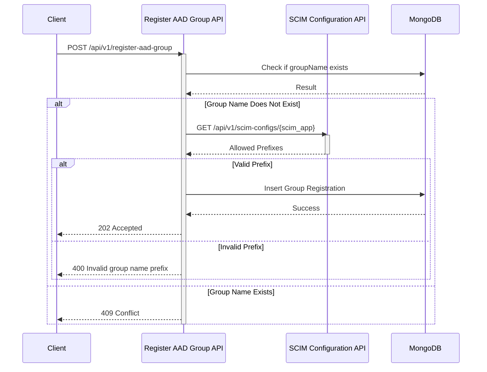

# Register AAD Group API Documentation

## 1. Service Overview

### 1.1 Purpose
This API allows authorized users to register Azure Active Directory (AAD) groups for use with specific SCIM applications. This registration process ensures that groups are properly configured and managed for seamless integration with target systems.

### 1.2 Scope
#### In Scope
- Registration of AAD groups.
- Validation of group names against allowed prefixes for the specified SCIM application.
- Association of an AAD group with a specific SCIM application.
- Tracking the registration status of AAD groups.

#### Out of Scope
- Creation or deletion of AAD groups.
- Management of SCIM application configurations (handled by the SCIM Configuration API).
- User provisioning or de-provisioning.

### 1.3 Sequence Diagram


### 1.4 Service Dependencies
- **Upstream Services:**
  - Services requiring AAD group registration.
- **Downstream Dependencies:**
  - SCIM Configuration API: To retrieve allowed group name prefixes for SCIM applications.
  - MongoDB: For storing AAD group registration information.

## 2. Data Model

### 2.1 Core Entities
#### AADGroupRegistration
```json
{
    "id": "string (uuid)",
    "groupName": "string",
    "owner": {
        "id": "string (uuid)",
        "email": "string"
    },
    "scim_app": "string",
    "aadStatus": {
        "status": "PENDING" | "PROCESSING" | "COMPLETE" | "FAILED",
        "lastUpdated": "datetime"
    },
    "ownerStatus": {
        "status": "PENDING" | "PROCESSING" | "COMPLETE" | "FAILED",
        "lastUpdated": "datetime"
    },
    "scimStatus": {
        "status": "PENDING" | "PROCESSING" | "COMPLETE" | "FAILED",
        "lastUpdated": "datetime"
    },
    "created_at": "datetime",
    "updated_at": "datetime"
}
```

### 2.2 Field Level Mapping
| Field Name | Data Type | Required | Description | Validation Rules | Default Value |
|------------|-----------|----------|-------------|------------------|---------------|
| id | String (UUID) | Yes | Unique identifier for the group registration | UUID format |  |
| groupName | String | Yes | Name of the AAD group | Max length 256 |  |
| owner.id | String (UUID) | Yes | Object ID of the group owner in AAD | UUID format |  |
| owner.email | String | Yes | Email of the group owner | Valid email format |  |
| scim_app | String | Yes | Name of the SCIM application | Max length 100 |  |
| aadStatus.status | String | Yes | Status of the AAD group registration process | Enum: PENDING, PROCESSING, COMPLETE, FAILED | PENDING |
| aadStatus.lastUpdated | DateTime |  | Timestamp of the last status update for AAD | ISO 8601 format |  |
| ownerStatus.status | String | Yes | Status of the owner verification process | Enum: PENDING, PROCESSING, COMPLETE, FAILED | PENDING |
| ownerStatus.lastUpdated | DateTime |  | Timestamp of the last status update for owner verification | ISO 8601 format |  |
| scimStatus.status | String | Yes | Status of the SCIM application configuration process | Enum: PENDING, PROCESSING, COMPLETE, FAILED | PENDING |
| scimStatus.lastUpdated | DateTime |  | Timestamp of the last status update for SCIM configuration | ISO 8601 format |  |
| created_at | DateTime | Yes | Timestamp of when the group registration was created | ISO 8601 format | Current timestamp |
| updated_at | DateTime | Yes | Timestamp of when the group registration was last updated | ISO 8601 format | Current timestamp |

### 2.3 Database Schema
```javascript
// MongoDB Collection: aad_group_registrations
{
  validator: {
    $jsonSchema: {
      bsonType: "object",
      required: [ "id", "groupName", "owner", "scim_app", "aadStatus", "ownerStatus", "scimStatus", "created_at", "updated_at" ],
      properties: {
        id: { bsonType: "string" },
        groupName: { bsonType: "string", maxLength: 256 },
        owner: {
          bsonType: "object",
          required: [ "id", "email" ],
          properties: {
            id: { bsonType: "string" },
            email: { bsonType: "string" }
          }
        },
        scim_app: { bsonType: "string", maxLength: 100 },
        aadStatus: {
          bsonType: "object",
          required: [ "status" ],
          properties: {
            status: { bsonType: "string", enum: [ "PENDING", "PROCESSING", "COMPLETE", "FAILED" ] },
            lastUpdated: { bsonType: "date" }
          }
        },
        ownerStatus: {
          bsonType: "object",
          required: [ "status" ],
          properties: {
            status: { bsonType: "string", enum: [ "PENDING", "PROCESSING", "COMPLETE", "FAILED" ] },
            lastUpdated: { bsonType: "date" }
          }
        },
        scimStatus: {
          bsonType: "object",
          required: [ "status" ],
          properties: {
            status: { bsonType: "string", enum: [ "PENDING", "PROCESSING", "COMPLETE", "FAILED" ] },
            lastUpdated: { bsonType: "date" }
          }
        },
        created_at: { bsonType: "date" },
        updated_at: { bsonType: "date" }
      }
    }
  }
}

// Indexes
db.aad_group_registrations.createIndex({ "groupName": 1 }, { unique: true });
db.aad_group_registrations.createIndex({ "scim_app": 1 });
db.aad_group_registrations.createIndex({ "created_at": 1 });
```

## 3. API Endpoints

### 3.1 Base URL
```
https://api.example.com/v1/register-aad-group
```

### 3.2 Endpoint Definitions

#### Register AAD Group
- **Method:** POST
- **Path:** `/`
- **Required Scope:** `aad_group.register.write`

##### Request Body
```json
{
    "groupName": "az_adb_data_scientists",
    "owner": {
        "id": "12345678-1234-5678-1234-567812345678",
        "email": "john.doe@example.com"
    },
    "scim_app": "unity_catalog"
}
```

##### Response (202 Accepted)
```json
{
    "id": "550e8400-e29b-41d4-a716-446655440000",
    "groupName": "az_adb_data_scientists",
    "owner": {
        "id": "12345678-1234-5678-1234-567812345678",
        "email": "john.doe@example.com"
    },
    "scim_app": "unity_catalog",
    "aadStatus": {
        "status": "PROCESSING"
    },
    "ownerStatus": {
        "status": "PROCESSING"
    },
    "scimStatus": {
        "status": "PROCESSING"
    },
    "created_at": "2024-01-20T10:30:00Z",
    "updated_at": "2024-01-20T10:30:00Z"
}
```

##### Error Responses
| Status Code | Error Code | Description |
|-------------|------------|-------------|
| 400 | ERR_2000 | Invalid input |
| 400 | ERR_2001 | Invalid group name prefix for SCIM app |
| 401 | ERR_1000 | Authentication required |
| 403 | ERR_1002 | Insufficient scope |
| 409 | ERR_4000 | Group name already exists |

#### Get AAD Group Registration by ID
- **Method:** GET
- **Path:** `/{id}`
- **Required Scope:** `aad_group.register.read`

##### Path Parameters
| Parameter | Type | Required | Description |
|-----------|------|----------|-------------|
| id | String (UUID) | Yes | Unique identifier of the group registration |

##### Response (200 OK)
```json
{
    "id": "550e8400-e29b-41d4-a716-446655440000",
    "groupName": "az_adb_data_scientists",
    "owner": {
        "id": "12345678-1234-5678-1234-567812345678",
        "email": "john.doe@example.com"
    },
    "scim_app": "unity_catalog",
    "aadStatus": {
        "status": "PROCESSING"
    },
    "ownerStatus": {
        "status": "PROCESSING"
    },
    "scimStatus": {
        "status": "PROCESSING"
    },
    "created_at": "2024-01-20T10:30:00Z",
    "updated_at": "2024-01-20T10:30:00Z"
}
```

##### Error Responses
| Status Code | Error Code | Description |
|-------------|------------|-------------|
| 401 | ERR_1000 | Authentication required |
| 403 | ERR_1002 | Insufficient scope |
| 404 | ERR_3000 | Registration not found |

## 4. Authentication & Authorization

### 4.1 Authentication
Refer to [common/auth-requirements.md](common/auth-requirements.md) for detailed authentication implementation.

### 4.2 Required Scopes
| Endpoint | HTTP Method | Required Scope | Description |
|----------|-------------|--------------------------|-------------|
| / | POST | `aad_group.register.write` | Register a new AAD group |
| /{id} | GET | `aad_group.register.read` | Get AAD group registration details |

## 5. Error Handling
Refer to [common/error-handling.md](common/error-handling.md) for detailed error handling implementation.

## 6. Data Validation Rules

### 6.1 Input Validation
```python
from pydantic import BaseModel, Field, EmailStr
from typing import Dict

class Owner(BaseModel):
    id: str = Field(..., description="AAD Object ID")
    email: EmailStr = Field(...)

class RegisterAADGroupRequest(BaseModel):
    groupName: str = Field(..., min_length=1, max_length=256, description="Name of the AAD group")
    owner: Owner = Field(...)
    scim_app: str = Field(..., min_length=1, max_length=100, description="Name of the SCIM application")

```

### 6.2 Business Rules
- Group names must be unique across the system.
- Group names must follow Azure naming conventions.
- Group name must start with one of the allowed prefixes for the specified SCIM app.
  - Example: For SCIM app "unity_catalog", group name must start with either "az_adb_" or "az_databricks_".
  - This ensures proper routing and access management in target systems.
  - The allowed prefixes are retrieved from the SCIM Configuration API.
  - Invalid prefix combinations will be rejected (ERR_2001).
- Owner must be a valid AAD user.
- SCIM app must exist in the SCIM Configuration API.
- All status transitions must be tracked.
- Error messages must be preserved for troubleshooting.

### 6.3 Example Prefix Validation
```python
async def validate_group_name_prefix(group_name: str, scim_app: str) -> bool:
    # Get SCIM app configuration
    # Assuming get_scim_config returns an object with an 'allowed_prefixes' attribute
    scim_config = await get_scim_config(scim_app)
    if not scim_config:
        raise ValueError("SCIM app not found")

    # Check if group name starts with any allowed prefix
    return any(
        group_name.startswith(prefix)
        for prefix in scim_config.allowed_prefixes
    )

# Usage Example:
# unity_catalog prefixes: ["az_adb_", "az_databricks_"]
# Valid: "az_adb_data_scientists" ✓
# Valid: "az_databricks_engineers" ✓
# Invalid: "data_scientists" ✗
# Invalid: "dbx_analysts" ✗
```

## 7. Performance Requirements

### 7.1 SLA Targets
- Response Time: 95th percentile < 200ms
- Availability: 99.9%

### 7.2 Resource Limits
- Max Request Size: 1MB
- Rate Limits: 100 requests per minute per client

## 8. Security Requirements

### 8.1 Data Classification
- Data Sensitivity: Medium
- PII Fields:
  - owner.email

### 8.2 Security Controls
- TLS 1.2 or higher required.
- OAuth 2.0 authentication required.
- Access logs for all operations.
- Input validation for all fields.

## 9. Development Guidelines

### 9.1 Code Organization
```
aad-group-registration-service/
├── api/
│   ├── routes/
│   │   ├── __init__.py
│   │   └── registration.py
│   ├── models/
│   │   ├── __init__.py
│   │   └── registration.py
│   └── dependencies/
│       ├── __init__.py
│       └── auth.py
├── core/
│   ├── config.py
│   └── security.py
├── db/
│   ├── models.py
│   └── repositories/
│       ├── __init__.py
│       └── registration.py
└── services/
    └── business_logic/
        ├── __init__.py
        └── registration.py
```

### 9.2 Development Setup
```bash
# Environment setup
python -m venv venv
source venv/bin/activate

# Install dependencies
pip install -r requirements.txt

# Database setup
mongosh
use aad_group_registration_db
db.createCollection("aad_group_registrations", {
  validator: { ... } // Copy schema from above
})

# Start service
uvicorn main:app --reload
```

## 10. Testing Requirements

### 10.1 Test Categories
1. Unit Tests
   - Input validation
   - Business rule enforcement
   - Prefix validation
   - Error handling

2. Integration Tests
   - Registration workflow
   - Interaction with SCIM Configuration API
   - Database operations
   - Error scenarios

### 10.2 Test Data
- Valid and invalid group names
- Valid and invalid owner information
- Existing and non-existing SCIM apps
- Group names with valid and invalid prefixes

## Appendix

### A. Changelog
| Version | Date       | Changes                                         | Author        |
|---------|------------|-------------------------------------------------|---------------|
| 1.0.0   | 2024-01-20 | Initial version                                 | System Team   |

### B. References
- MongoDB Schema Validation
- Azure Active Directory API Documentation
- SCIM 2.0 Protocol
- REST API Best Practices
