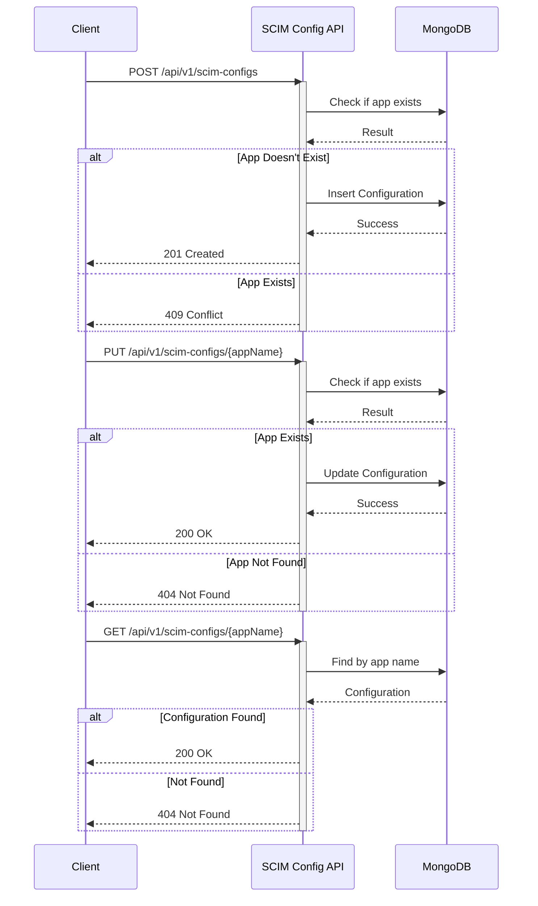

# SCIM Configuration API Documentation

## 1. Service Overview

### 1.1 Purpose
The SCIM Configuration API provides a centralized service for managing SCIM application configurations, including their object IDs and allowed group name prefixes. This enables controlled group provisioning across different technology platforms.

### 1.2 Scope
#### In Scope
- SCIM application configuration management
- Prefix pattern validation
- Configuration retrieval by app name
- Audit trail maintenance

#### Out of Scope
- SCIM provisioning execution
- Group creation/management
- User provisioning
- Direct platform integration

### 1.3 Sequence Diagram


### 1.4 Service Dependencies
- **Upstream Services:**
  - Services requiring SCIM configuration
- **Downstream Dependencies:**
  - MongoDB for configuration storage

## 2. Data Model

### 2.1 Core Entities
#### SCIMConfiguration
```json
{
    "scim_app": "string",
    "scim_objectId": "string",
    "allowed_prefixes": ["string"],
    "created_by": "string",
    "created_at": "datetime",
    "updated_by": "string",
    "updated_at": "datetime"
}
```

### 2.2 Field Level Mapping
| Field Name | Data Type | Required | Description | Validation Rules | Default Value |
|------------|-----------|----------|-------------|------------------|---------------|
| scim_app | String | Yes | SCIM application name | max_length=100, unique | None |
| scim_objectId | String | Yes | SCIM application object ID | max_length=100 | None |
| allowed_prefixes | Array[String] | Yes | List of allowed group name prefixes | min_items=1, pattern=^[a-zA-Z0-9-_]+$ | None |
| created_by | String | Yes | User who created the config | Valid email format | None |
| created_at | DateTime | Yes | Creation timestamp | ISO 8601 format | Current timestamp |
| updated_by | String | Yes | User who last updated the config | Valid email format | None |
| updated_at | DateTime | Yes | Last update timestamp | ISO 8601 format | Current timestamp |

### 2.3 Database Schema
```javascript
// MongoDB Collection: scim_configs
{
  validator: {
    $jsonSchema: {
      bsonType: "object",
      required: ["scim_app", "scim_objectId", "allowed_prefixes", "created_by", "created_at", "updated_by", "updated_at"],
      properties: {
        scim_app: {
          bsonType: "string",
          maxLength: 100
        },
        scim_objectId: {
          bsonType: "string",
          maxLength: 100
        },
        allowed_prefixes: {
          bsonType: "array",
          minItems: 1,
          items: {
            bsonType: "string",
            pattern: "^[a-zA-Z0-9-_]+$"
          }
        },
        created_by: {
          bsonType: "string",
          pattern: "^[a-zA-Z0-9._%+-]+@[a-zA-Z0-9.-]+\\.[a-zA-Z]{2,}$"
        },
        created_at: {
          bsonType: "date"
        },
        updated_by: {
          bsonType: "string",
          pattern: "^[a-zA-Z0-9._%+-]+@[a-zA-Z0-9.-]+\\.[a-zA-Z]{2,}$"
        },
        updated_at: {
          bsonType: "date"
        }
      }
    }
  }
}

// Indexes
db.scim_configs.createIndex({ "scim_app": 1 }, { unique: true });
db.scim_configs.createIndex({ "created_at": 1 });
```

## 3. API Endpoints

### 3.1 Base URL
```
https://api.example.com/v1/scim-configs
```

### 3.2 Endpoint Definitions

#### Create SCIM Configuration
- **Method:** POST
- **Path:** `/scim-configs`
- **Required Scope:** `scim.config.write`

##### Request Body
```json
{
    "scim_app": "databricks",
    "scim_objectId": "12345678-1234-5678-1234-567812345678",
    "allowed_prefixes": ["dbx-", "databricks-"]
}
```

##### Response (201 Created)
```json
{
    "scim_app": "databricks",
    "scim_objectId": "12345678-1234-5678-1234-567812345678",
    "allowed_prefixes": ["dbx-", "databricks-"],
    "created_by": "admin@example.com",
    "created_at": "2024-01-20T10:30:00Z",
    "updated_by": "admin@example.com",
    "updated_at": "2024-01-20T10:30:00Z"
}
```

##### Error Responses
| Status Code | Error Code | Description |
|-------------|------------|-------------|
| 400 | ERR_2000 | Invalid input |
| 401 | ERR_1000 | Authentication required |
| 403 | ERR_1002 | Insufficient scope |
| 409 | ERR_4000 | App name already exists |

#### Update SCIM Configuration
- **Method:** PUT
- **Path:** `/scim-configs/{appName}`
- **Required Scope:** `scim.config.write`

##### Path Parameters
| Parameter | Type | Required | Description |
|-----------|------|----------|-------------|
| appName | String | Yes | SCIM application name |

##### Request Body
```json
{
    "scim_objectId": "12345678-1234-5678-1234-567812345678",
    "allowed_prefixes": ["dbx-", "databricks-", "db-"]
}
```

##### Response (200 OK)
```json
{
    "scim_app": "databricks",
    "scim_objectId": "12345678-1234-5678-1234-567812345678",
    "allowed_prefixes": ["dbx-", "databricks-", "db-"],
    "created_by": "admin@example.com",
    "created_at": "2024-01-20T10:30:00Z",
    "updated_by": "admin@example.com",
    "updated_at": "2024-01-20T10:35:00Z"
}
```

##### Error Responses
| Status Code | Error Code | Description |
|-------------|------------|-------------|
| 400 | ERR_2000 | Invalid input |
| 401 | ERR_1000 | Authentication required |
| 403 | ERR_1002 | Insufficient scope |
| 404 | ERR_3000 | Configuration not found |

#### Get SCIM Configuration
- **Method:** GET
- **Path:** `/scim-configs/{appName}`
- **Required Scope:** `scim.config.read`

##### Path Parameters
| Parameter | Type | Required | Description |
|-----------|------|----------|-------------|
| appName | String | Yes | SCIM application name |

##### Response (200 OK)
```json
{
    "scim_app": "databricks",
    "scim_objectId": "12345678-1234-5678-1234-567812345678",
    "allowed_prefixes": ["dbx-", "databricks-", "db-"],
    "created_by": "admin@example.com",
    "created_at": "2024-01-20T10:30:00Z",
    "updated_by": "admin@example.com",
    "updated_at": "2024-01-20T10:35:00Z"
}
```

##### Error Responses
| Status Code | Error Code | Description |
|-------------|------------|-------------|
| 401 | ERR_1000 | Authentication required |
| 403 | ERR_1002 | Insufficient scope |
| 404 | ERR_3000 | Configuration not found |

## 4. Authentication & Authorization

### 4.1 Authentication
Refer to [common/auth-requirements.md](common/auth-requirements.md) for detailed authentication implementation.

### 4.2 Required Scopes
| Endpoint | HTTP Method | Required Scope | Description |
|----------|-------------|----------------|-------------|
| /scim-configs | POST | scim.config.write | Create new SCIM configuration |
| /scim-configs/{appName} | PUT | scim.config.write | Update SCIM configuration |
| /scim-configs/{appName} | GET | scim.config.read | Get SCIM configuration |

## 5. Error Handling
Refer to [common/error-handling.md](common/error-handling.md) for detailed error handling implementation.

## 6. Data Validation Rules

### 6.1 Input Validation
```python
from pydantic import BaseModel, Field, EmailStr
from typing import List
from datetime import datetime

class SCIMConfigCreate(BaseModel):
    scim_app: str = Field(..., max_length=100, regex="^[a-zA-Z0-9-_]+$")
    scim_objectId: str = Field(..., max_length=100)
    allowed_prefixes: List[str] = Field(..., min_items=1)

class SCIMConfigUpdate(BaseModel):
    scim_objectId: str = Field(..., max_length=100)
    allowed_prefixes: List[str] = Field(..., min_items=1)

class SCIMConfig(SCIMConfigCreate):
    created_by: EmailStr
    created_at: datetime
    updated_by: EmailStr
    updated_at: datetime
```

### 6.2 Business Rules
- SCIM app names must be unique
- At least one prefix must be provided
- Prefixes must follow valid pattern
- Object ID must be valid
- Audit fields must be maintained
- App name cannot be modified after creation

## 7. Performance Requirements

### 7.1 SLA Targets
- Response Time: 95th percentile < 200ms
- Availability: 99.9%

### 7.2 Resource Limits
- Max Request Size: 1MB
- Rate Limits: 100 requests per minute per client
- Concurrent Requests: 50 per client
- Maximum prefixes per app: 100

## 8. Security Requirements

### 8.1 Data Classification
- Data Sensitivity: Medium
- PII Fields:
  - created_by
  - updated_by
- Retention Period: Indefinite (configurations are long-lived)

### 8.2 Security Controls
- TLS 1.2 or higher required
- OAuth 2.0 authentication required
- Access logs for all operations
- Audit trail for all changes
- Rate limiting per client
- Input validation for all fields

## 9. Development Guidelines

### 9.1 Code Organization
```
scim-config-service/
├── api/
│   ├── routes/
│   │   ├── __init__.py
│   │   └── configs.py
│   ├── models/
│   │   ├── __init__.py
│   │   └── configs.py
│   └── dependencies/
│       ├── __init__.py
│       └── auth.py
├── core/
│   ├── config.py
│   └── security.py
├── db/
│   ├── models.py
│   └── repositories/
│       ├── __init__.py
│       └── configs.py
└── services/
    └── business_logic/
        ├── __init__.py
        └── configs.py
```

### 9.2 Development Setup
```bash
# Environment setup
python -m venv venv
source venv/bin/activate

# Install dependencies
pip install -r requirements.txt

# Database setup
mongosh
use scim_service_db
db.createCollection("scim_configs", {
  validator: { ... } // Copy schema from above
})

# Start service
uvicorn main:app --reload
```

## 10. Testing Requirements

### 10.1 Test Categories
1. Unit Tests
   - Input validation
   - Prefix pattern validation
   - Business rule enforcement
   - Error handling

2. Integration Tests
   - Configuration CRUD operations
   - Duplicate handling
   - Audit field tracking
   - Error scenarios

3. Performance Tests
   - Configuration retrieval speed
   - Concurrent operations
   - Rate limit enforcement

### 10.2 Test Data
- Valid and invalid app names
- Various prefix patterns
- Different object ID formats
- Update scenarios
- Error conditions

## Appendix

### A. Changelog
| Version | Date | Changes | Author |
|---------|------|---------|---------|
| 1.0.0   | 2024-01-20 | Initial version | System Team |

### B. References
- MongoDB Schema Validation
- SCIM 2.0 Protocol
- Azure AD Object ID Format
- REST API Best Practices
